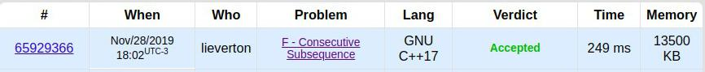

# Problemas de Programação Dinâmica

**Número da Lista**: Lista 5 
**Conteúdo da Disciplina**: Programação Dinâmica - variantes da LIS e Coin Change; Knapsack. 

## Alunos

|Matrícula | Aluno |
| -- | -- |
| 17/0039251  |  Lieverton Santos Silva |
| 17/0024121  |  Welison Lucas Almeida Regis |

## Sobre

Optou-se por resolver três problemas de programação dinâmica em diferentes plataformas de juízes online — codeforces, hackerrank, spoj. Focou-se em fazer `markdowns` com tutorial, passo a passo, sobre as características dos problemas, além de uma análise da complexidade de cada abordagem que tenta resolver o problema.

###   Problemas

1. Knapsack: algoritmo clássico do problema da mochila:
   1. Link para o problema: [Knapsack](https://www.spoj.com/problems/KNAPSACK/).
   2. Solução: [Solução Knapsack](./knapsack.md).
2. Maior subsequência consecutiva crescente: problema variante da LIS, maior subsequência crescente. 
   1.  Link para o problema: [977F](https://codeforces.com/contest/977/problem/F)
   2.  Solução: [Solução variante LIS](./longest_consecutive_subsequence.md).
   3.  Empecilho: algoritmos quadráticos excedem o tempo da questão.
3. Número de trocos possíveis: problema variante do coin change, solicita quantas combinações de troco em um conjunto de moedas `S` considerando um valor de troco `N`.

## Screenshots

* Problemas aceitos:

