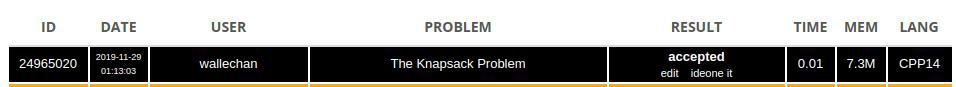

# Knapsack

## Origem

*   Sphere Online Judge, The Knapsack Problem.
*   Link: [Knapsack](https://www.spoj.com/problems/KNAPSACK/).

A questão acima trabalha o clássico algoritmo conhecido como knapsack, o "Algoritmo da Mochila". Tem-se uma mochila de capacidade S, e objetiva-se levar itens que provêm um benefício V a custo de um peso W de maneira ótima.

## Enunciado

The famous knapsack problem. You are packing for a vacation on the sea side and you are going to carry only one bag with capacity `S (1 <= S <= 2000)`. You also have `N (1<= N <= 2000)` items that you might want to take with you to the sea side. Unfortunately you can not fit all of them in the knapsack so you will have to choose. For each item you are given its size and its value. You want to maximize the total value of all the items you are going to bring. What is this maximum total value?

### Input

On the first line you are given S and N. N lines follow with two integers on each line describing one of your items. The first number is the size of the item and the next is the value of the item.

### Output

You should output a single integer on one like - the total maximum value from the best choice of items for your trip.

## Exemplo 1

Entrada:
```
4 5
1 8
2 4
3 0
2 5
2 3
```

Saída:
```
13
```

## Resolução

Pode-se resolver o problema da mochila tanto de forma recursiva quanto iterativa. Optou-se por, nesse caso, implementar o algoritmo iterativo, que possui os seguintes passos de implementação:

1. `knap[n+1][W+1]`: Declara-se uma matriz com n+1 linhas, isto é, o número de items + 1, pois o algoritmo também considera 0 itens; e W+1 colunas, sendo W o peso da mochila e considerando que existe peso 0 também.
2. Agora, utiliza-se os índices `i` e `w` para percorrer nos itens e nos pesos possíveis, respectivamente. 
3. O algoritmo baseia-se em três principais condições:
   1. `if (i == 0 || w == 0)`: caso base da dp, isto é, zero itens ou peso 0, logo, o melhor valor será: knap[i][w] = 0;
   2. `else if (weight[i-1] <= w)`: caso o peso do item seja inferior ao peso da coluna, deve-se optar pela melhor escolha entre pegar ou não o item da seguinte maneira: `knap[i][w] = max(profit[i-1]+knap[i-1][w-weight[i-1]], knap[i-1][w]);`.
   3. `else`: caso o peso do item seja superior ao peso da coluna, a melhor escolha será o item acima na tabela: `knap[i][w] = knap[i-1][w];`.
4. Computada a matriz, basta retornar o melhor benefício que se pode obter nas condições da mochila `return knap[items_quantity][max_weight];`.

### Complexidade

Complexidade: O(n²).

* Resposta aceita:



## Código

```cpp
#include <bits/stdc++.h>
using namespace std;

int knapsack(int max_weight, vector<int> weight, vector<int> profit) {
    int items_quantity = profit.size();
    int knap[items_quantity+1][max_weight+1];

    for(int i = 0; i <= items_quantity; i++) {
        for(int w = 0; w <= max_weight; w++) {
            if (i == 0 || w == 0)
                knap[i][w] = 0;
            else if (weight[i-1] <= w)
                knap[i][w] = max(profit[i-1]+knap[i-1][w-weight[i-1]], knap[i-1][w]);
            else
                knap[i][w] = knap[i-1][w];
        }
    }
    
    return knap[items_quantity][max_weight];
}

int main() {
    int N, W;
    cin >> W >> N;
    
    vector<int> weight(N), profit(N);
    for(int i = 0; i < N; i++)
        cin >> weight[i] >> profit[i];
    
    int ans = knapsack(W, weight, profit);
    cout << ans << '\n';
    
    return 0;
}
```