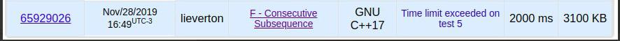

# Maior Subsequência Consecutiva

## Origem

*   Codeforces Round 479, Divisão 3, Questão F.
*   Link: [977F](https://codeforces.com/contest/977/problem/F).

A questão aborda um problema parecido com a LIS, maior subsequência crescente, porém, deve-se encontrar a maior subsequência crescente em que os termos sejam consecutivos e, além disso, exige-se que o tempo de resposta seja extremamente rápido para grandes entradas.

## Enunciado 

You are given an integer array of length n.

You have to choose some subsequence of this array of maximum length such that this subsequence forms a increasing sequence of consecutive integers. In other words the required sequence should be equal to `[x,x+1,…,x+k−1]` for some value x and length k.

Subsequence of an array can be obtained by erasing some (possibly zero) elements from the array. You can erase any elements, not necessarily going successively. The remaining elements preserve their order. For example, for the array `[5,3,1,2,4]` the following arrays are subsequences: `[3], [5,3,1,2,4], [5,1,4]`, but the array `[1,3]` is not.
 
 
### Input

The first line of the input containing integer number `n (1 ≤ n ≤ 2⋅10⁵)` — the length of the array. The second line of the input containing n integer numbers `a1, a2, …, an (1 ≤ ai ≤ 10⁹)`— the array itself.

### Output 

On the first line print k — the maximum length of the subsequence of the given array that forms an increasing sequence of consecutive integers.

On the second line print the sequence of the indices of the any maximum length subsequence of the given array that forms an increasing sequence of consecutive integers.

## Exemplo 1

Entrada:
```
7
3 3 4 7 5 6 8
```

Saída:
```
4
2 3 5 6 
```

## Resolução 1

Após um primeiro contato, percebe-se facilmente que a questão é bem parecida com o conhecido problema da maior subsequência crescente (LIS). Nessa situação, pode-se utilizar o algoritmo da LIS com a observação de que os elementos devem ser consecutivos. Desse modo, conforme explicado em sala, pode-se aplicar a seguinte lógica:

1. Utilize dois índices, i e j, sendo que o `i` marcará a posição do elemento que terminará a subsequência e o `j` irá variar da esquerda para a direita até o `i`.
2. Caso `arr[i] == arr[j]+1`, significa que são consecutivos e, deve-se verificar se `lis[i] < lis[j] + 1`, isto é, ver se a subsequência é maior que a já armazenada.
3. Caso as condições anteriores sejam atendidas, atualiza `lis[i] = lis[j] + 1;` e salva a posição do termo que é antecessor ao termo atual `backtrack_ids[i] = j;`.
4. Após isso, passe no vetor `lis` e recupere a posição que marca a maior subsequência consecutiva crescente.
5. Agora, basta iniciar um `backtrack` a partir da posição que termina a sequência para descobrir qual será os índices da sequência formada.

## Complexidade

Complexidade: O(n²).

* Resposta excede o limite de tempo da questão:



## Código

```cpp
#include <bits/stdc++.h>
using namespace std;
vector <int> backtrack_ids;
int subseq_size;
 
int lis (vector<int> arr, int n)  
{  
    int lis[n];
    lis[0] = 1;
    backtrack_ids = vector<int> (n,0);  
  
    for (int i = 1; i < n; i++ ) { 
        lis[i] = 1; 
        for (int j = 0; j < i; j++ ) {
            if (arr[i] == arr[j]+1 && lis[i] < lis[j] + 1) {
                    lis[i] = lis[j] + 1;
                    backtrack_ids[i] = j;            
            }
        }   
    }

    int last_id = 0;
    for (int i = 1; i < n; i++) {
        if (lis[i] > lis[last_id]) {
            last_id = i;
            subseq_size = lis[i];
        }
    }
    return last_id;
} 
 
int main() {
    size_t n;
    cin >> n;

    vector <int> vi(n);
    for (auto &value : vi)
        cin >> value;

    int ans = lis(vi, n);

    if (!ans) {
        cout << "1\n1\n";
        return 0;
    }

    cout << subseq_size << endl;

    vector<int> subsequence_ids;
    while (subseq_size--) {
        subsequence_ids.push_back(ans+1);
        ans = backtrack_ids[ans];
    }
    reverse (subsequence_ids.begin(), subsequence_ids.end());
 
    for (auto value : subsequence_ids)
        cout << value << " ";
    cout << endl;
    
    return 0;
}
```
