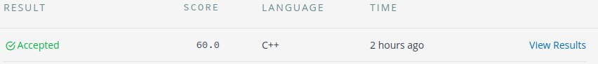

# O Problema de Trocar Moedas

## Origem

*   HackerRank - [The Coin Change Problem](https://www.hackerrank.com/challenges/coin-change/problem)

A questão aborda o problema de trocar moedas. A partir de um conjunto de moedas deve-se respoder de quantas formas é possível trocar um determinado valor.

## Enunciado

You are working at the cash counter at a fun-fair, and you have different types of coins available to you in infinite quantities. The value of each coin is already given. Can you determine the number of ways of making change for a particular number of units using the given types of coins?

For example, if you have **4** types of coins, and the value of each type is given as **8,3,1,2** respectively, you can make change for **3** units in three ways: **{1,1,1}**, **{1,2}**, and **{3}**.

**Function Description**

Complete the getWays function in the editor below. It must return an integer denoting the number of ways to make change.

getWays has the following parameter(s):

*  n: an integer, the amount to make change for
*  c: an array of integers representing available denominations
 
 
### Input

The first line contains two space-separated integers describing the respective values of **n** and **m**, where:
**n** is the number of units
**m** is the number of coin types
The second line contains **m** space-separated integers describing the respective values of each coin type : `c = [c[0],c[1]...c[m-1]` (the list of distinct coins available in infinite amounts).

**Constraints**


*  `1 ≤ c[i] ≤ 50`
*  `1 ≤ n ≤ 250`
*  `1 ≤ m ≤ 50`
*  Each `c[i]` is guaranteed to be distinct.

### Output 

Print a long integer denoting the number of ways we can get a sum of  from the given infinite supply of **m** types of coins.

## Exemplo 1

Entrada:
```
4 3
1 2 3
```

Saída:
```
4 
```
## Exemplo 2

Entrada:
```
10 4
2 5 3 6
```

Saída:
```
5
```

## Resolução

Pode-se resolver o problema em questão com a seguinte abordagem:

1. `table[i]`: armazena o número de soluções para o valor i.
2. Precisamos de n + 1 linhas quando a tabela é construida bottom up usando o caso base = 1;e
3. Percorrer todas moedas atualizando os valores da `tabela` da seguinte maneira: `table[j] += table[j-vi[i]]`. Após isso, o último elemento da `tabela` será a resposta.

### Complexidade

Complexidade: O(nm).

* Resposta aceita:




## Código

```cpp
#include <bits/stdc++.h>
using namespace std;

long long count(int n, int m, vector<int> vi) 
{ 
    vector<long long> table(n+1,0);
  
    table[0] = 1; 
  
    for (int i = 0; i < m; i++) 
        for(int j = vi[i]; j <= n; j++) 
            table[j] += table[j-vi[i]]; 
  
    return table[n]; 
}

int main() {
    
    ios::sync_with_stdio(false);
    
    int n, m;
    cin >> n >> m;

    vector<int> vi(m);

    for (auto &i : vi)
        cin >> i;

    cout << count(n, m, vi) << endl;    

    return 0;
}
```